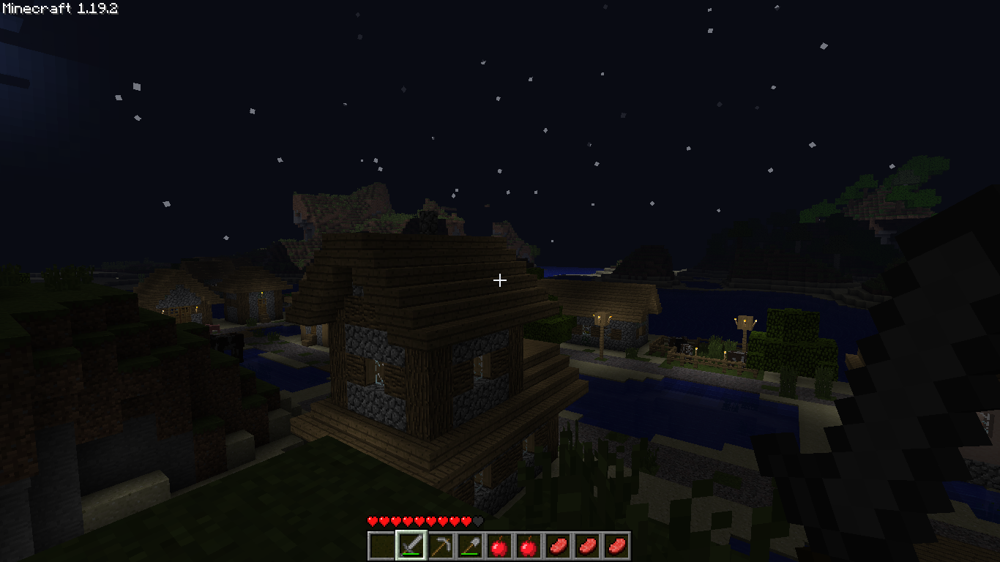

# classicraft

The classic feel of Minecraft must be preserved.

## Credits

[nostalgic tweaks]: https://github.com/Adrenix/Nostalgic-Tweaks
[adrenix]: https://github.com/Adrenix
[hybrid beta]: https://www.planetminecraft.com/data-pack/hybrid-beta-1-18-1-a-beta-style-interpretation-of-modern-minecraft-terrain/
[crystalis7]: https://www.planetminecraft.com/member/crystalis7/
[developer art classic]: https://www.planetminecraft.com/texture-pack/devart-classic/
[shmoobalizer]: https://github.com/shmoobalizer
[packwiz]: https://github.com/packwiz/packwiz
[comp500]: https://github.com/comp500
[no raw ores]: https://www.curseforge.com/minecraft/customization/no-raw-ores-datapack/
[cabbage beta]: https://github.com/CyborgCabbage/cabbagebeta
[cyborgcabbage]: https://github.com/CyborgCabbage

This wouldn't exist without the amazing of work of the following people:

-   [nostalgic tweaks] by [adrenix] - The classic feel of Minecraft into modern versions
-   [hybrid beta] by [crystalis7] - A mix of classic-like world generation with modern features
-   [cabbage beta] by [cyborgcabbage] - A block-accurate recreation of the Beta 1.7.3 terrain generation
-   [developer art classic] by [shmoobalizer] - Classic textures and feel back in the game
-   [packwiz] by [comp500] - The command-line tool used to create the modpack
-   [no raw ores] by crazyjerz - Bring back the classic ore drops
-   beta doors by Jimbo - bring back old beta door side textures
-   unlock all recipes by vanilla tweaks (credits.txt)

## The goals of this modpack

### Classic feel

The goal of this modpack is to bring back the classic feel of Minecraft alongside modern features.
This means that the world generation, core features, and textures will be similar to the classic versions
of the game, but at the same time allowing for modern features.

### Performance

The modpack is designed to be as lightweight as possible, while still providing a good experience.

### Customizable

The modpack is designed to allow you to remove the features you don't want, and add the
features you do want. By default, these are included:

-   **Old lighting and fog rendering** - The classic lighting engine from Beta 1.7.3
-   **Classic-like world generation** - Chose between a Beta 1.7.3-inspired world generation with modern
    features or a block-perfect recreation of Beta 1.7.3 terrain generation
-   **Classic-like textures, particles, and sounds** - Classic textures, sounds, and feel back in the game
-   **Extra music nostalgia** - Replace current music with C418 extra soundtrack
-   **No hunger and sprinting system** - No sprinting and classic hunger: regenerate health by eating,
    and non-stackable food items
-   **Directional damage and old animal spawning** - When you received damage, the camera used
    to tilt in the direction of the damage.
-   And much more!

### Server-friendly

Classic-like Minecraft wouldn't be complete without multiplayer support, right? Although
I'm not providing a server pack **for now**, you can easily create one by yourself by
copying the `config/` folder and using a few mods like:

-   Alternate Current - [Performance] Alternative redstone implementation
-   Krypton - [Performance] Optimizations for Minecraft's networking stack
-   Lithium - [Performance] Optimizations for Minecraft's world generation and entity AI
-   Starlight - [Performance] Rewrite of Minecraft's lighting engine
-   NoChatReports - [Quality of Life] Prevents chat reports from being sent to the server
-   FerriteCore - [Performance] Reduces memory usage of Minecraft
-   memoryLeakFix - [Performance] Fixes a bunch of memory leak issues in Minecraft
-   Nostalgic Tweaks 2.0 - [Core] The responsible for the nostalgic experience
-   Hybrid Beta World Gen (Data Pack) or Cabbage Beta (Mod) - [Core] The responsible for
    the nostalgic experience

## Choose your world generation!

When creating a new world, you will be able to choose between two different world generation
by selecting the world type to 'Beta' to use Cabbage Beta, or simply by letting it as the
'Default' and going to 'Data Packs' and selecting 'Hybrid Beta'.
